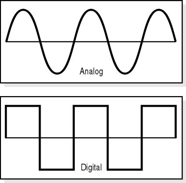
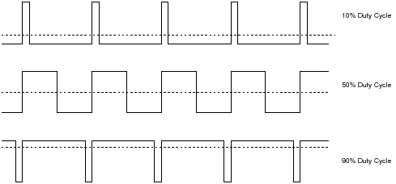
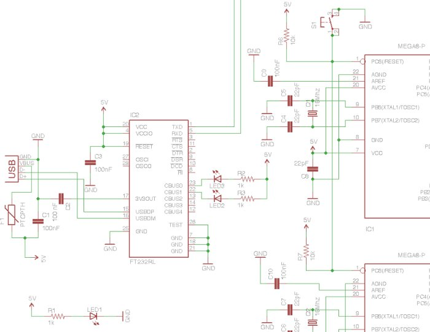

!SLIDE center

# Alguns conceitos básicos de eletrônica

!SLIDE center
# Sinal analógico e digital #

!SLIDE center
# PWM (Modulação por largura de pulso) #

!SLIDE center
# Esquemático

!SLIDE center

