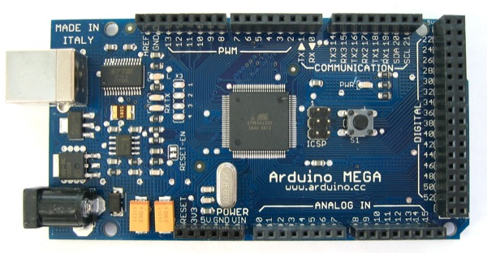

!SLIDE center
# Arduino Mega #

!SLIDE center
# Especificações #

<table border='0' width='90%'>
	<tr>
		<td  align='left' width='30%'>Microcontrolador</td>
		<td  align='left'>ATmega1280</td>
	</tr> 
	<tr>
		<td  align='left'>Tensão de operação</td>
		<td  align='left'>5V</td>
	</tr> 
	<tr>
		<td  align='left'>Pinos de I/O digital</td>
		<td  align='left'>54  (dos quais 14 fornece saídas PWM)</td>
	</tr> 
	<tr>
		<td  align='left'>Pinos de entrada analógica</td>
		<td  align='left'>16</td>
	</tr> 
	<tr>
		<td  align='left'>Corrent por pino de I/O</td>
		<td  align='left'>40 mA</td>
	</tr> 
	<tr>
		<td  align='left'>Corrente por pino de I/O de 3.3V</td>
		<td  align='left'>50 mA</td>
	</tr> 
	<tr>
		<td  align='left'>Memória Flash</td>
		<td  align='left'>128 KB sendo que 4 KB são usados pelo bootloader</td>
	</tr> 
	<tr>
		<td  align='left'>SRAM</td>
		<td  align='left'>8 KB</td>
	</tr>
	<tr>
		<td  align='left'>EEPROM</td>
		<td  align='left'>4 KB</td>
	</tr> 
	<tr>
		<td  align='left'>Velocidade do Clock</td>
		<td  align='left'>16 MHz</td>
	</tr> 
</table> 
