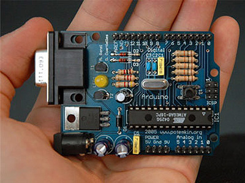

!SLIDE center
# Arduino #

!SLIDE

# Fabio Utzig

## fabio.utzig@gmail.com

!SLIDE bullets incremental
# O que é? #

* Computação física
* HW + IDE (baseada em processing)
* Fácil de usar
* Prototipação
* Hacking em geral

!SLIDE bullets incremental
# Licenças #

* Esquemáticos de HW disponíveis livremente (Creative Commons)
* IDE e infra-estrutura de código aberto (GPL e LGPL)
* Arduino é *marca registrada*
